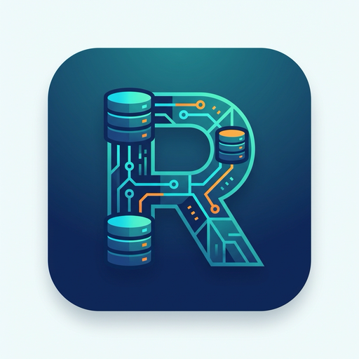

# RECCH

<div align="center">
  
  <h3>Modern Database Management Tool</h3>
  <p>Cross-platform, secure, and intelligent database manager built with Rust & Vue.</p>

  [](LICENSE)
</div>

## Features

- **🚀 Multi-Database Support**: Seamlessly connect to MySQL, PostgreSQL, and Redis.
- **🤖 Smart Assistant**: Natural language to SQL/Redis commands conversion for efficient querying.
- **🎨 Modern UI**: Clean, responsive interface with Dark/Light themes powered by Naive UI.
- **🛠️ Structure Designer**: Visual table schema editor for managing columns, keys, and indexes.
- **🔒 Secure & Local**: All connection data is stored locally. No cloud sync required.
- **🖥️ Cross-Platform**: Native performance on macOS, Windows, and Linux via Tauri.

## Tech Stack

- **Frontend**: Vue 3, TypeScript, Vite, Naive UI
- **Backend**: Rust, Tauri, SQLx, Redis
- **Architecture**: Local-first, secure, and high-performance.

## Development

### Prerequisites

- Node.js (v16+)
- Rust (Stable)

### Setup

```bash
# Install frontend dependencies
npm install

# Run backend/frontend in development mode
npm run tauri dev
```

### Build

```bash
# Build for production
npm run tauri build
```

## License

MIT License.
