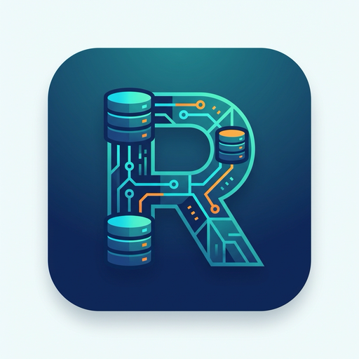

# RECCH

<div align="center">
  
  
  <h3>🚀 Next-Generation Database Management Tool</h3>
  <p>A modern, AI-powered database manager built with Rust & Vue for exceptional performance and developer experience.</p>

  [](LICENSE)
  []()
  [](https://tauri.app)

  **[English](#-features) | [中文](#-功能特性)**
</div>

---

## ✨ Features

### 🤖 AI-Powered Query Assistant
- **Natural Language to SQL**: Describe what you need in plain language, and let AI generate the perfect query.
- **Multi-Model Support**: Compatible with OpenAI, Qwen, DeepSeek, Moonshot, Ollama, and more.
- **Context-Aware**: AI understands your table schema for accurate query generation.

### 🗄️ Multi-Database Support
- **MySQL** - Full support for MySQL 5.7+
- **PostgreSQL** - Complete PostgreSQL integration
- **Redis** - Key browser with type-aware value display

### 🎨 Modern User Experience
- **Beautiful UI**: Clean, responsive interface powered by Naive UI.
- **Dark/Light Themes**: Switch themes to match your preference.
- **Smart Data Display**: JSON auto-detection, syntax highlighting, and collapsible long text.
- **Server-Side Sorting**: Sort entire tables, not just loaded data.

### 🛠️ Developer-Friendly Tools
- **Visual Schema Editor**: Design and modify table structures with ease.
- **CRUD Operations**: Inline editing, creation, and deletion of records.
- **Query Console**: Execute raw SQL/Redis commands with syntax highlighting.
- **Column Comments**: View field descriptions inline (just like DBeaver!).
- **Database Export / Import**: Run full database export or import directly from the connection list.
- **Export Progress Feedback**: Large database exports show percentage, current table progress, and support stopping mid-run.

### 🔒 Secure & Private
- **100% Local**: All connection credentials stored locally on your machine.
- **No Cloud Sync**: Database operations are local to this application. AI generation sends your prompt and selected schema to the configured AI provider only after explicit confirmation.
- **Open Source**: Fully transparent codebase you can audit and trust.

### 🖥️ Cross-Platform Native Performance
- Built with **Rust** and **Tauri** for blazing-fast, memory-efficient operation.
- Native apps for **macOS**, **Windows**, and **Linux**.
- Minimal resource footprint compared to Electron-based alternatives.

---

## 🛠️ Tech Stack

| Layer | Technology |
|-------|------------|
| Frontend | Vue 3, TypeScript, Vite, Naive UI |
| Backend | Rust, Tauri, SQLx, Redis |
| AI | OpenAI-compatible API (Qwen, GPT, DeepSeek, Ollama, etc.) |
| Architecture | Local-first, Secure, High-performance |

---

## 🆕 Recent Updates

- Database-level export and import are available from the connection list for MySQL and PostgreSQL.
- Export progress now shows percentage, current table progress, and a stop button for long-running tasks.
- Large table export behavior has been improved to keep progress feedback more stable during long runs.

---

## 📦 Installation

Download the latest release for your platform:

👉 **[Releases](https://github.com/happydigua/recch/releases)**

| Platform | File |
|----------|------|
| macOS (Apple Silicon) | `RECCH_x.x.x_aarch64.dmg` |
| macOS (Intel) | `RECCH_x.x.x_x64.dmg` |
| Windows | `RECCH_x.x.x_x64-setup.exe` |
| Linux (Debian/Ubuntu) | `recch_x.x.x_amd64.deb` |
| Linux (AppImage) | `RECCH_x.x.x_amd64.AppImage` |

---

## 🧑‍💻 Development

### Prerequisites

- Node.js (v22.13+)
- Rust 1.89+ (Stable)
- Platform-specific dependencies (see [Tauri v2 Prerequisites](https://v2.tauri.app/start/prerequisites/))

### Quick Start

```bash
# Clone the repository
git clone https://github.com/happydigua/recch.git
cd recch

# Install frontend dependencies
npm install

# Run in development mode
npm run tauri dev
```

### Build for Production

```bash
npm run tauri build
```

---

## 🤝 Contributing

Contributions are welcome! Feel free to:

- 🐛 Report bugs
- 💡 Suggest features
- 🔧 Submit pull requests

---

## 📜 License

MIT License. See [LICENSE](LICENSE) for details.

---

<div align="center">
  <h1>RECCH</h1>
  
  
  <h3>🚀 新一代数据库管理工具</h3>
  <p>基于 Rust 和 Vue 构建的现代化、AI 驱动的数据库管理器，提供卓越的性能和开发体验。</p>
</div>

---

## ✨ 功能特性

### 🤖 AI 智能查询助手
- **自然语言转 SQL**：用自然语言描述需求，AI 自动生成精准的查询语句。
- **多模型支持**：兼容 OpenAI、通义千问、DeepSeek、Moonshot、Ollama 等主流大模型。
- **上下文感知**：AI 理解表结构，生成更准确的查询。

### 🗄️ 多数据库支持
- **MySQL** - 完整支持 MySQL 5.7+
- **PostgreSQL** - 全面的 PostgreSQL 集成
- **Redis** - 可视化 Key 浏览器，支持多种数据类型展示

### 🎨 现代化用户体验
- **精美界面**：基于 Naive UI 的简洁响应式界面。
- **深色/浅色主题**：随心切换，保护眼睛。
- **智能数据展示**：自动识别 JSON、语法高亮、长文本折叠。
- **服务端排序**：对整个数据表排序，而非仅当前页面数据。

### 🛠️ 开发者友好工具
- **可视化结构编辑器**：轻松设计和修改表结构。
- **CRUD 操作**：行内编辑、创建、删除记录。
- **查询控制台**：执行原生 SQL/Redis 命令，支持语法高亮。
- **字段注释显示**：像 DBeaver 一样直接显示字段备注。
- **数据库级导出 / 导入**：可直接在连接列表里执行整库导出和导入。
- **导出进度反馈**：大库导出时显示百分比、当前表进度，并支持中途停止。

### 🔒 安全与隐私
- **100% 本地化**：所有连接凭证存储在本地。
- **无云同步**：数据库操作由本机发起；AI 生成功能经明确确认后，会将需求和选定表结构发送到配置的 AI 服务。
- **开源透明**：代码完全开放，值得信赖。

### 🖥️ 跨平台原生性能
- 基于 **Rust** 和 **Tauri** 构建，极致快速、内存高效。
- 原生支持 **macOS**、**Windows**、**Linux**。
- 相比 Electron 应用，资源占用极低。

---

## 🛠️ 技术栈

| 层级 | 技术 |
|------|------|
| 前端 | Vue 3、TypeScript、Vite、Naive UI |
| 后端 | Rust、Tauri、SQLx、Redis |
| AI | OpenAI 兼容 API（通义千问、GPT、DeepSeek、Ollama 等） |
| 架构 | 本地优先、安全、高性能 |

---

## 🆕 最近更新

- MySQL 和 PostgreSQL 已支持在连接列表中直接进行数据库级导出与导入。
- 数据库导出现在会显示百分比、当前表进度，并支持手动停止。
- 大表导出流程已优化，长时间导出时的进度反馈更稳定。

---

## 📦 安装

下载适用于您平台的最新版本：

👉 **[发布页面](https://github.com/happydigua/recch/releases)**

| 平台 | 文件 |
|------|------|
| macOS (Apple Silicon) | `RECCH_x.x.x_aarch64.dmg` |
| macOS (Intel) | `RECCH_x.x.x_x64.dmg` |
| Windows | `RECCH_x.x.x_x64-setup.exe` |
| Linux (Debian/Ubuntu) | `recch_x.x.x_amd64.deb` |
| Linux (AppImage) | `RECCH_x.x.x_amd64.AppImage` |

---

## 🧑‍💻 开发指南

### 环境要求

- Node.js (v22.13+)
- Rust 1.89+ (Stable)
- 平台特定依赖 (参见 [Tauri v2 环境准备](https://v2.tauri.app/start/prerequisites/))

### 快速开始

```bash
# 克隆仓库
git clone https://github.com/happydigua/recch.git
cd recch

# 安装前端依赖
npm install

# 开发模式运行
npm run tauri dev
```

### 构建生产版本

```bash
npm run tauri build
```

---

## 🤝 贡献

欢迎贡献！你可以：

- 🐛 报告 Bug
- 💡 提出新功能建议
- 🔧 提交 Pull Request

---

## 📜 许可证

MIT 许可证。详见 [LICENSE](LICENSE)。

---

<div align="center">
  <p>Made with ❤️ by <a href="https://github.com/happydigua">happydigua</a></p>
</div>

## Safety and supported limits / 安全与支持边界

- Connection and AI configuration JSON is replaced atomically, locked against concurrent writers, and owner-only on Unix. This is **not encryption at rest**; Windows access relies on the user-profile directory ACL. Corrupt JSON is reported, never silently reset.
- Row-file import uses a database transaction (MySQL requires InnoDB); arbitrary SQL-script import is not promised to be transactional because scripts may contain DDL or explicit commits. A network failure during COMMIT can leave the outcome unknown: verify before retrying.
- Each Redis operation and raw SQL request owns its session. A manual SELECT, MULTI, USE, SET or transaction does not carry over to later requests. Put related commands in one request. Redis key browsing is bounded at 10000 keys; oversized values and unsupported SQL types produce an explicit error instead of truncated backup data.
- The built-in database SQL exporter is a **limited logical table exporter**, not a replacement for pg_dump/mysqldump. It rejects detected unsupported objects, uses a consistent snapshot for supported transactional tables, and replaces the selected file only on success. Use native database backup tools for full schema, permissions, extension objects, custom sequence options and disaster recovery. Always test restoration into a disposable database.
- Binary fields cannot be losslessly represented by this grid's generic CSV/JSON import/export or text editor, so those operations are blocked for binary tables. Database-level SQL export writes actual binary literals. Bigint and exact decimals are transported as text to avoid JavaScript rounding.
- AI responses are untrusted suggestions and are never automatically executed. HTTPS is required except for explicitly configured loopback services.

配置文件并非加密存储；本轮改进不等同于“零风险”认证。整库 SQL 导出仍有明确支持范围，生产备份应使用数据库原生工具，并在独立测试库验证恢复。跨平台单元测试和一次性数据库集成测试不替代真实桌面端到端及大规模压力测试。
